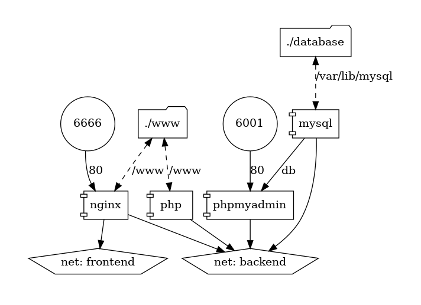

# DockerProjekt2

Polecenia do uruchomienia stacka docker-compose up -d

stworzenie bazy danych docker exec <nazwa_kontenera> mysql --execute="CREATE DATABASE <nazwa_bazy_danych>" --user=<nazwa_uzytkownika> --password=<haslo_uzytkownika>

wygenerowanie struktury projektu docker container run --rm -it --name mgraph -v $(pwd):/input pmsipilot/docker-compose-viz render -m image docker-compose.yaml

reprezentacja graficzna projektu:

